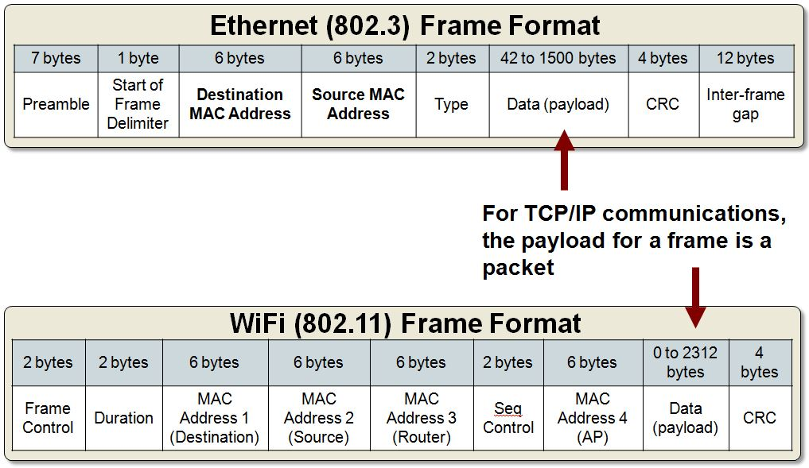

# Layer 2 : "data link"

Layer 2 Data Link is Responsible for :

- physical addressing (link between two directly connected nodes)
- error correction,
- and preparing the information for the media (encore and decode information into bits).

IEEE-802 LAN standards divides the data link layer into two sublayers:[5]

- Media access control (MAC) layer – responsible for controlling how devices in a network gain access to a medium and permission to transmit data.
- Logical link control (LLC) layer – responsible for identifying and encapsulating network layer protocols, and controls error checking and frame synchronization.

# Examples for different frame standards

- 802.3 Ethernet,
- 802.11 Wi-Fi,  
- 802.15.4 ZigBee
- The Point-to-Point Protocol (PPP) is a data link layer protocol that can operate over several different physical layers, such as synchronous and asynchronous serial lines.

Here is a schema to better understand how ethernet and Wi-Fi frames differ :

