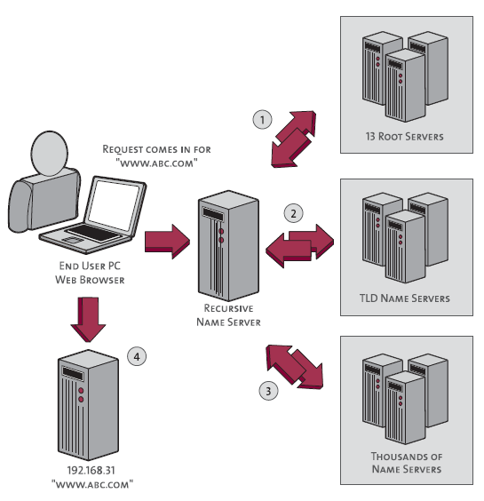

# The chain of event to get the IP address for google.com from DNS servers

Here is an excellent picture describing the chain of events of a DNS lookup. The image is from Verisign, and to simplify matters a bit it ignores the effect of caching (normally results are cached at various points along the chain):

- First your computer queries the name server (DNS server) it is set up to use (a DNS server IP is provided in its network configuration). This is the recursive name server shown above. [explore how a machine sends a message to another machine with ip address](../../common/networking/). Port 53 is opened to send a UDP request to DNS server (if the response size is too large, TCP will be used instead), requesting the A record for google.com.

- The name server check its lookup table and realise it doesn’t know the IP address for google.com, so it will start the following chain of queries before it can report back the IP address to your computer :

  - Query the Internet root servers to get the name servers for the .com TLD (top-level domain).
  - Query the .com TLD name servers to get the authoritative name servers for google.com.
  - Query the authoritative name servers for google.com to finally get the IP address for the host google.com, then return that IP address to your computer.
